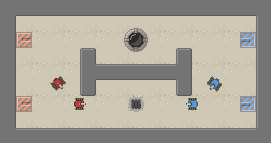

Customizing the Field
=====================

Game fields are based on a tilemap where each tile can only be occupied by a single object. This means they can
be represented conveniently by an ASCII representation. You can instantiate fields from these ASCII representations
as well. Suppose we create a file `field.txt` with the following contents::

    w w w w w w w w w w w w w w w w w
    w _ _ _ _ _ _ _ _ _ _ _ _ _ _ _ w
    w R _ _ _ _ _ _ C _ _ _ _ _ _ B w
    w _ _ _ _ w _ _ _ _ _ w _ _ _ _ w
    w _ _ _ _ w w w w w w w _ _ _ _ w
    w _ _ _ _ w _ _ _ _ _ w _ _ _ _ w
    w R _ _ _ _ _ _ A _ _ _ _ _ _ B w
    w _ _ _ _ _ _ _ _ _ _ _ _ _ _ _ w
    w w w w w w w w w w w w w w w w w

We can then load it up using the :meth:`domination.core.Field.from_string` function, the map defined aboves looks like the image below::

    field = core.Field.from_string(open('field.txt').read())
    core.Game(field=field).run()
    

The default maps are randomly generated using the :class:`~domination.core.FieldGenerator` class, it has a number of paramters for generating maps.

.. autoclass:: domination.core.FieldGenerator
   :members: